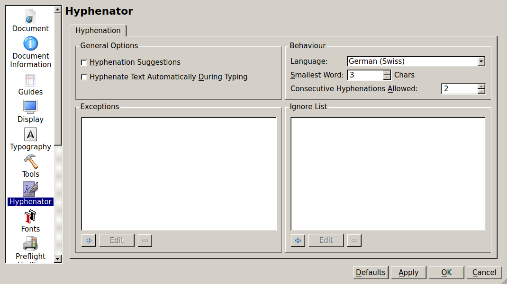

# Notes

## Flowing around text

On july 17, 2016 garry [writes in the forus](http://forums.scribus.net/index.php/topic,2127.msg9548.html#msg9548)

Here's the basic technique:
- Draw your text frame and put your text in it;
- Draw your image frame and put an image in it (or you can use whatever other object you want);
* Make sure that your image frame is at a higher level (or on a higher layer) than the text frame (text only flows around stuff that is "above" it.);
* Select the image frame and go to Properties Palette;
* Choose the "Shape" tab (or the "Group" tab if your image is in a group);
* Select one of the Text Flow options, Contour Line is best (for reasons I won't go into here);
* Move the image frame around to place it where you want.

If the text is too near the image then:
* Select the image frame and go to Properties Palette;
* Choose the "Shape" tab (or the "Group" tab if your image is in a group);
* Press the "Edit..." button;
* Check the "Edit Contour Line" box in the Node Editor dialog that has just popped up (very important as you're flowing around the Contour Line);
* Adjust the nodes as appropriate for what you want to do;
* When finished, press the "End Editing" button in the Node Editor dialog.

And that's it. If you're not happy with the flow then move the frame or re-edit the contour line.

## Smart placement of frames

If you select the Insert Text Frame icon (or press T), then hold down the Shift key, clicking the page will create a frame up to the margins.

Of course, the "shift" shortcut-modifier can also be used with image frames or any other type of items.

## Creating chained text frames

If you have a document where you want to place linked text frames that fill with full the whole page (at least if it will be so at the beginning of your layout work) you can create a document with the number of pages you plan to have.

Next, load your text in a new text frame on the first page where the text will start to appear and zoom out a bit (or a lot) to see multiple pages at once.

While the first frame is selected, press the "n" key to activate the "Link to the next text frame" tool and "shift-click" in the middle of the next empty page (or empty column if you have multiple columns) to fill it.

Without deselecting the newly created frame, repeat the "n + shift-click" cycles until you have placed all your linked text.

It is to be noted, that -- when creating a document -- Scribus proposes the option of automatically create frames on each page. In most cases, this option is a bad idea: at some time you'll probably want to interrupt of the flow of frames and the automatic creation of text frames will only get in your way.

## Hyphenate

### 1.4.6

frist, file > document setup > hyphenator: and pick a language...

then you can select a single (linked set of) text frame(s) and hyphenate it with "extras > hyphenate text"
